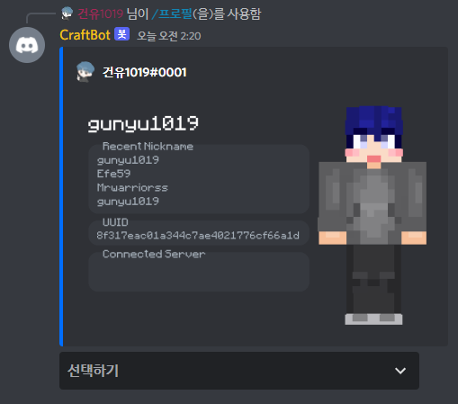
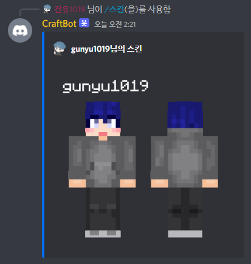

    

<h1 align="center">Craft Bot</h1>

마인크래프트를 위한 디스코드 봇

# Introduce
마인크래프트와 관련된 다양한 각종 기능들을 제공하는 디스코드 봇입니다. 
아래의 나열된 기능을 제공합니다.
### Microsoft XBOX 계정을 통한 마인크래프트 계정 간 프로필 연동

Microsoft Oauth2를 활용하여 XBOX 정보를 제공받고, XBOX 정보를 기반으로 마인크래프트 정보를 불러옵니다.

### 디스코드 프로필을 통한 연동된 마인크래프트 프로필 조회§

사용자는 등록된 계정을 명령어를 통해 검색 할 수 있습니다.

아래의 정보를 제공합니다.
* 사용자가 가입한 마인크래프트 서버 나열 (커뮤니티 프리미엄 서비스)
* 사용자 이전 닉네임 조회
* 사용자 프로필 비공개 기능
* 사용자 이전 닉네임 비공개 기능

### 연동된 계정을 통한 정품 사용자 확인에 따른 디스코드 역할 부여
CraftBot에 연동한 정보를 기반으로 마인크래프트 정품 유저를 구분합니다. 
해당 기능을 통하여 커뮤니티 관리자가 지정한 역할을 인증된 유저 한정으로 제공합니다.

### 마인크래프트 스킨 조회

검색한 사용자의 스킨 정보를 조회합니다. 앞과 뒤를 이미지로 제공합니다.

### 마인크래프트 자바에디션 서버 정보 조회
마인크래프트 자바 에디션의 서버 정보를 제공합니다. 
ping, query, SRV 통신을 통해 접속자 목록, 서버 레이턴시, 서버 이름을 이미지로 제공합니다.

### 마인크래프트 베드락 에디션 서버 정보 조회
마인크래프트 베드락 에디션의 서버 정보를 제공합니다.

### 커뮤니티 전용 기능
해당 기능은 커뮤니티 전용 기능으로 서버 정보를 디스코드에 등록하여 조회할 수 있도록 합니다. 
향후 협의를 통해 커뮤니티 전용 기능을 제작 후 CraftBot에 등록 할 수 있습니다.

* 하이픽셀 전적 조회 (예시)
  * 하이픽셀 종합 및 길드 정보
  * 배드워즈 전적
  * 스카이워 전적
  * 머더미스터리 전적

#### ~~디스코드 커뮤니티와 마인크래프트 서버간 화이트리스트 권한 자동 부여~~
해당 기능은 2차 업데이트로 고려하고 있습니다. 
마인크래프트 플러그인과 연동을 통하여 인증된 사용자는 자동으로 화이트리스트에 등재하는 기능입니다.

# Core Technology
아래에는 CraftBot의 주요 개발 목적 및 핵심 기술을 나열해보았습니다.

### 디스코드 봇와 웹서비스를 통한 Microsoft XBOX 계정 연동
* [Microsoft Module](modules/microsoft.py): Microsoft Oauth2 기능을 제공하는 모듈
* [views/session.py](views/session.py): 웹사이트를 통한 Oauth2 기능 제공 (Flask 기반)

### 마인크래프트 스킨 렌더링

(Skin Render 모듈을 활용한 마인크래프트 스킨 렌더링 예시)

* [Skin Render Module](modules/skin_render.py): 마인크래프트 스킨 렌더링 모듈